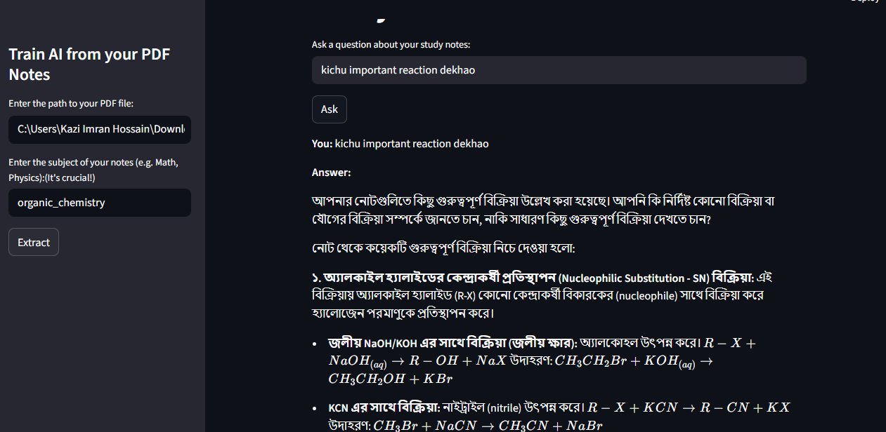

# ⚡ ScholarAI

```
   ___  _     ____  ____  _____     __   __  
  / _ \| |   |  _ \|  _ \| ____|   / /   \ \ 
 | | | | |   | |_) | |_) |  _|    / /     \ \
 | |_| | |___| __/|  _ <| |___   / /       \ \
  \__\_\_____|_|   |_| \_\_____|/_/  REVIEW  \_\
```

> *"Knowledge locked in pages... until now."*

---

## 🌸 What is this?

**ScholarAI** is an intelligent document analysis system powered by Google Gemini and a custom RAG (Retrieval-Augmented Generation) pipeline. Feed it your PDFs — it reads them, understands them, and answers your questions like a brilliant study partner who never sleeps.

Ask in **Bengali or English**. Get answers with **full LaTeX math rendering**. It remembers the conversation. It finds exactly what you need.

---



## ⚔️ The Pipeline — How It Works

```
  [ Your PDF ]
       │
       ▼
  ┌─────────────────────────────┐
  │  PyMuPDF converts each      │
  │  page → image               │
  └────────────┬────────────────┘
               │
               ▼
  ┌─────────────────────────────┐
  │  Gemini Vision reads every  │
  │  image — Bengali, math,     │
  │  diagrams, handwriting      │
  └────────────┬────────────────┘
               │
               ▼
  ┌─────────────────────────────┐
  │  Gemini Embedding converts  │
  │  text → vectors (3072D)     │
  └────────────┬────────────────┘
               │
               ▼
  ┌─────────────────────────────┐
  │  ChromaDB stores vectors    │
  │  on disk permanently        │
  └────────────┬────────────────┘
               │
       [ You ask a question ]
               │
               ▼
  ┌─────────────────────────────┐
  │  Your question → embedded   │
  │  → ChromaDB finds closest   │
  │  matching pages             │
  └────────────┬────────────────┘
               │
               ▼
  ┌─────────────────────────────┐
  │  Gemini answers using only  │
  │  YOUR notes as context      │
  └─────────────────────────────┘
```

---

## 🚀 How to Use

**1.** Create a `.env` file in the project root:
```
GEMINI_API_KEY=your_api_key_here

```

**2.** Get your free Gemini API key and Openrouter API key from: https://aistudio.google.com/apikey 
**3.** Create and activate a virtual environment:
```bash
# Windows
python -m venv venv
venv\Scripts\activate

# Mac/Linux
python -m venv venv
source venv/bin/activate
```

**4.** Install all dependencies:
```bash
pip install -r requirements.txt
```

**5.** Launch the app:
```bash
streamlit run app.py
```
**6.**Before asking anything, insert your local pdf file's full path on the sidebar and click "Extract"

**7.** Done — start asking! ⚡

---

## 📁 Project Structure

When you click the "Extract" button, the program captures every image from every page of the PDF file and sends them to the AI model. This process occurs gradually.

Next, the AI model analyzes the images and generates a detailed description of each page's content. After that, these text descriptions are converted into vectors and stored in a vector database located in the data folder (within the app's local directory).

When you ask a question, the program converts your query into a vector and identifies several relevant matches in the database, which are stored as retrieved_text.

Finally, the program sends the retrieved_text, your original question, and the conversation history to the main Gemini Model. The model analyzes this context and provides an accurate answer.

Note: This project runs on open source Google's Gemma 4 model for extracting text from PDF. You can change the model in `extract.py` → line 12

```
ScholarAI/
├── app.py                  # Main app
├── extract.py              # Extract text from PDFs
├── embed.py                # Create embeddings
├── store.py                # Store in database
├── query.py                # Answer questions
├── requirements.txt        # Dependencies
├── .env                    # API key
│
├── data/
│   ├── vector_db/          # ChromaDB storage
│   └── json_files/         # Extracted text & embeddings
│
└── thumbnail_images/       # Preview images
```

---

## 🗡️ Tech Stack

```
Language      →  Python
UI            →  Streamlit
Vector DB     →  ChromaDB
PDF Parser    →  PyMuPDF (fitz)
AI Model      →  Google Gemini (vision + embedding + generation)
```

---

## 📜 License

```
Copyright 2026 Renerfia

Licensed under the Apache License, Version 2.0
```

---

<div align="center">

*Built with obsession. Powered by Gemini and Openrouter. Forged in Python.*

⭐ Star this repo if it helped you. It was made for educational purpose

</div>
